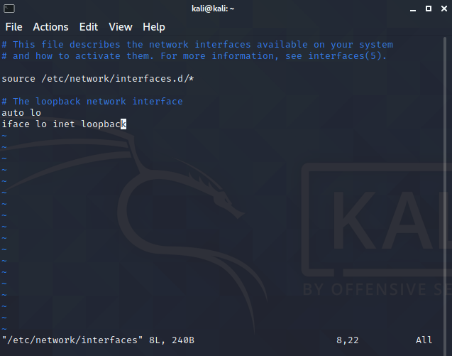

## 1. 网卡配置

打开终端运行：

```
sudo vi /etc/network/interfaces
```

将得到如下界面：



键入' i '进入编辑模式，在下方添加如下字段

- inface eth0 inet static          设置 eth0 使用默认的静态地址
- address 10.10.10.160         设置 eth0 的ip 地址
- gateway 10.10.10.2             配置当前主机的默认网关
- netmask 255.255.255.0       设置 eth0 的子网掩码


## 2. DNS配置

打开终端，运行：

```
sudo vim /etc/resolv.conf
```

打开为空白，键入i后添加DNS地址

```
nameserver 144.144.144.144
```

配置好后，按下Esc，:wq回车保存更改


## 2. 重启网卡

关闭网卡

```
sudo ipdown eth0
```

重新开启网卡

```
sudo ipup eth0
```

