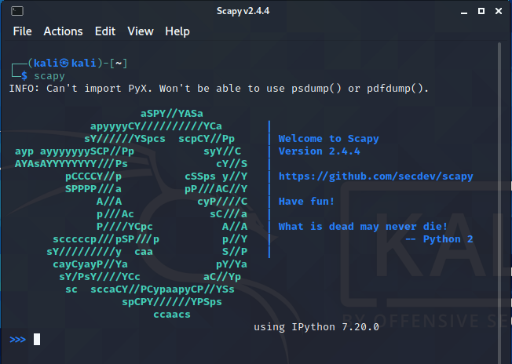
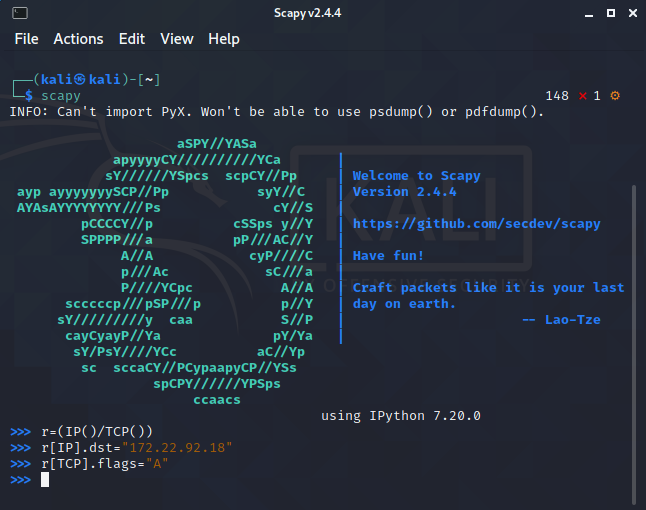

## 1. scapy介绍

Scapy的是一个强大的交互式数据包处理程序（使用python编写）。它能够伪造或者解码大量的网络协议数据包，能够发送、捕捉、匹配请求和回复包等等。

## 2. 安装scapy 

scapy是基于python的包，可以用Python的pip包管理工具下载安装

下载scapy包

```
pip install scapy
```

## 3. 应用

### 3.1 进入scapy

打开终端，输入scapy进入



进入scapy后命令行风格改变，现在就可以创建、发送数据包了

### 3.2 创建数据包

​		scapy的数据包创建按照的是TCP/IP协议的四层参考模型：网络接口层、互联网层、传输层、应用层。Scapy为每一层都写了相应的类，创建数据包时我们只要将这些类实例化，然后调用类的方法或改变类的参数值即可。各个层的协议都有各自的创建函数，如IP()、TCP()、UDP()等

```python
r=(IP()/TCP())
r[IP].dst="172.22.92.18"
r[TCP].flags="A"
```



构造了一个网络层的数据包，设定目标IP地址为172.22.92.18，flag标志为A表示给目标主机发送的是ACK应答数据包

### 3.3 发送并接收数据包

用sr1()函数将构造好的的数据包发送出去，并将目标主机返回的数据包传递给变量rep

```python
rep=sr1(r)
```


### 3.5 查看数据包信息

用display查看数据包的信息

```python
rep.display()
```

