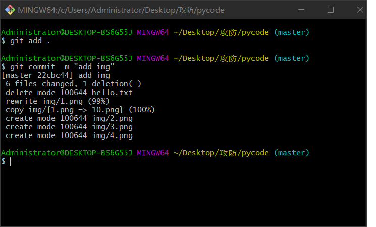

1. 本地安装git

   去[git官网](https://git-scm.com/)下载git软件，安装过程无脑下一步就行

   安装成功后在鼠标右击目录下会多出两项

   

   **Git GUI**：图形界面的Git，不建议初学者使用，尽量先熟悉常用命令

   **Git Bash**：Unix与Linux风格的命令行，使用最多，推荐最多

2. 设置用户名和邮箱

   你需要告诉本地git软件，你是一个有用户名、有邮箱的合法用户，若不设置，commit时会阻止提交到本地仓库

   ```shell
   git config --global user.name "用户"
   git config --global user.email 邮箱
   ```

3. 搭建仓库

   **有两种方式：**

   - 搭建本地仓库

     新建一个文件夹，作为本地仓库，即工作目录，右击选择**Git Bash Here**，执行初始化命令

     ```shell
     git init
     ```

   - 克隆远程仓库

     将远程服务器上的仓库完全镜像一份至本地

     ```shell
     git clone [url]
     ```

     

4. 使用码云

   **生成公钥**

   - 进入用户文件夹，比如  C:\Users\Administrator，找到.ssh文件夹
   - 进入.ssh文件夹，文件夹内右击选择Git Bash Here
   - 执行 ssh-keygen 生成公钥，此时文件夹内会生成两个文件id_rsa和id_rsa.pub

   **设置公钥**

   - 打开设置

   

   - 进入SSH公钥选项

     

   - 将刚刚生成的id_rsa.pub文件里的公钥复制到这里

     

5. 关联远程仓库

   ```shell
   git remote add gitee https://gitee.com/code_from_cjj/pycode.git
   ```

   命令解析

   remote add: 添加远程仓库

   gitee ：给远程仓库起个名称叫gitee

   https://gitee.com/code_from_cjj/pycode.git：远程仓库的地址

6. 后续操作

   以上操作完成后，在此工作目录下的改动都可以提交到本地或者远程的仓库中了

   - 添加到暂存区

     

   - 提交到本地仓库

     

   - 提交到远程仓库

     

   