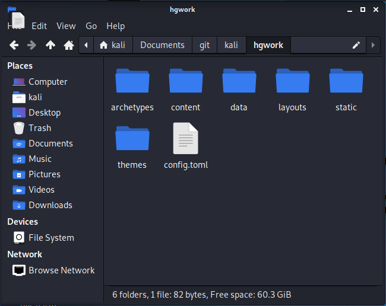
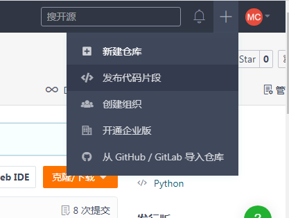
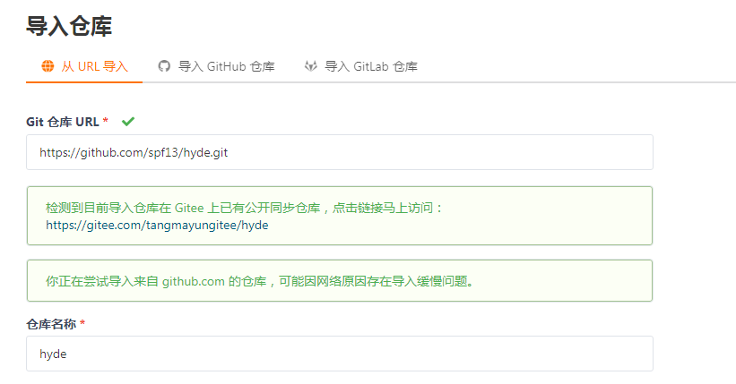

## hugo下载
linux 环境
```sh
    sudo apt-get install hugo
```
## hugo使用
### 1.生成站点
```sh
    hugo new site hgwork
```
**注：hgwork为创建的hugo项目名**

cd进入hgwork项目目录，生成的文件及文件夹为



### 2.创建一个文章
```sh
    hugo new post/first.md
```
在post目录下创建一个名为firs.md的markdown文件

### 3.下载一个皮肤

先cd到主题目录下，克隆一个主题到该目录

```sh
    cd themes
    git clone https://github.com/spf13/hyde.git
```

- 若因为墙GitHub主题无法下载

  gitee网页点击+号，导入github仓库

  

  将无法克隆的GitHub仓库地址复制到这里

  

  第二个框里就是对应的gitee地址，点进去就可以复制gitee地址，更改克隆地址
  ```sh
    git clone https://gitee.com/tangmayungitee/hyde.git
  ```

### 4.运行blog

编译：

```sh
    hugo -D
```

运行：

```sh
    hugo server -D
```

还可以指定皮肤

```sh
    hugo server --theme=hyde --buildDrafts
```

此时打开浏览器，访问http://localhost:1313/ 就能看到搭建的blog网页了