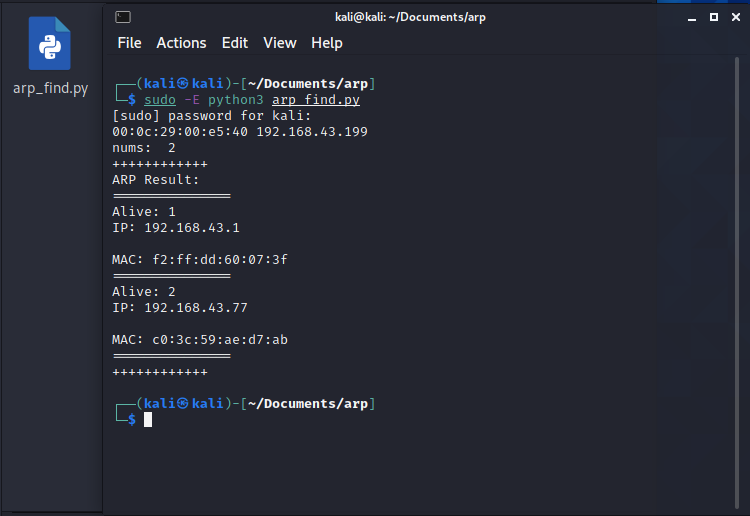

## python实现

用python代码实现网络主机发现

代码：

```python
import socket
from scapy.all import *
from getmac import get_mac_address

import socket,struct,fcntl

def get_ip(ifname):
    s = socket.socket(socket.AF_INET, socket.SOCK_DGRAM)
    return socket.inet_ntoa(fcntl.ioctl(s.fileno(), 0x8915, struct.pack('256s', bytes(ifname[:15],'utf-8')))[20:24])


# pip install getmac

def HostAddress():
    eth_mac = get_mac_address(interface="eth0")
    hostname = socket.gethostname()
    ip = get_ip("eth0")
    return (eth_mac, ip)

# ARP scapy

def ArpScan():
    mac = HostAddress()[0]
    ip = HostAddress()[1]
    iface = "eth0"
    
    
    print(mac, ip)

    ipSplit = ip.split('.') # 192.168.3.30
    ips = []
    for i in range(1, 255):
        # [192, 168, 3, 30]
        ip = ipSplit[0] + '.' + ipSplit[1] + '.' + ipSplit[2] + '.' + str(i)
        ips.append(ip)

    resp = srp(Ether(src=mac, dst="FF:FF:FF:FF:FF:FF")/ARP(op=1,hwsrc=mac,hwdst='00:00:00:00:00:00',pdst=ips),iface=iface,timeout=2,verbose=False)
    respAns = resp[0].res

    lives = []
    # recv packet amount
    nums = len(respAns)
    print("nums: ",nums)
    print("++++++++++++")
    print("ARP Result: ")
    print("===============")

    for x in range(nums):
        IP = respAns[x][1][1].fields['psrc']
        MAC = respAns[x][1][1].fields['hwsrc']
        lives.append([IP,MAC])
        print("Alive:", x+1)

        print("IP: " + IP + '\n\n' + "MAC: " + MAC)
        print("===============")

    print("++++++++++++")

if __name__ == '__main__':
    ArpScan()

```

通过终端运行（文件名为arp_find.py）

```shell
sudo -E python3 arp_find.py
```



通过运行结果可看出，当前局域网下有两台设备正在连接网络
