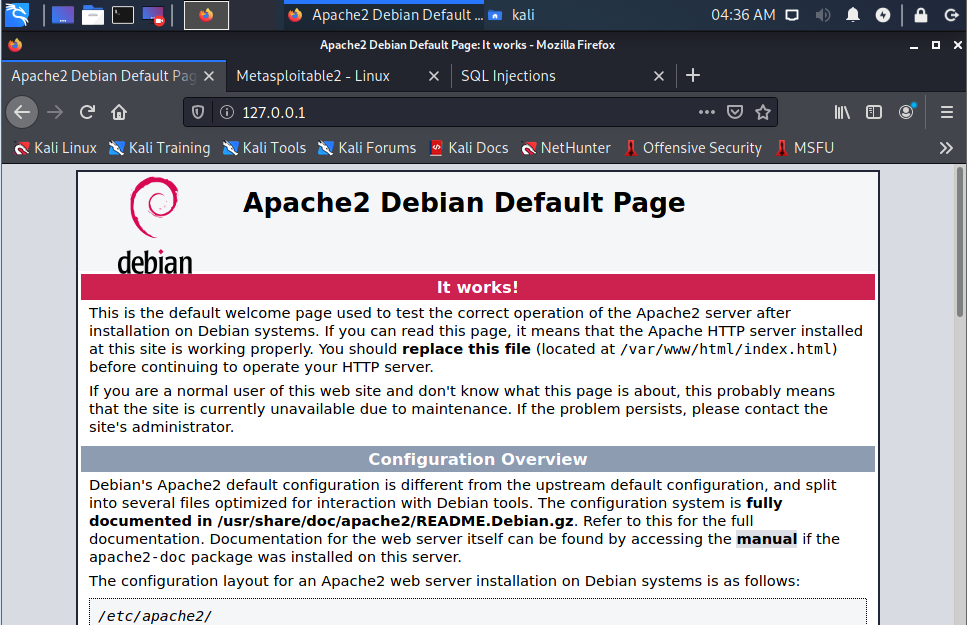
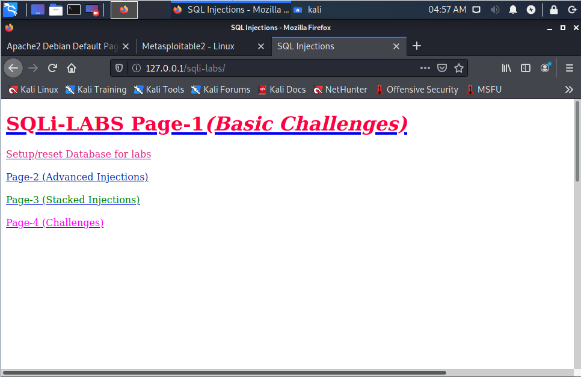

## 搭建SQLi 搭建靶场

1. 打开Apache服务

   kali自带apache服务器，只需要打开服务就行

   ```shell
   sudo service apache2 start
   ```

   打开kali的浏览器访问127.0.0.1或localhost，出现Apache服务器界面则开启成功

   

2. 配置MySQL数据库

   打开MySQL服务

   ```shell
   sudo service mysql start
   ```

   登录MySQL

   ```shell
   sudo mysql -uroot -p
   ```
   首次登录无需输入密码，提示输入密码时直接回车
   

   修改MySQL数据库的root用户密码

   ```mysql
   > SET PASSWORD FOR 'root'@'localhost' = PASSWORD('新的密码');
   ```

3. 安装sqli-labs

   ```shell
   cd /var/www/html
   git clone https://gitee.com/acezqy/sqli-labs-kali2.git sqli-labs
   ```

   kali中自带的PHP版本在7.0以上，无法直接使用一般版本的Sqli-labs

4. 修改配置文件

   ```shell
   vim sqli-labs/sql-connections/db-creds.inc
   ```

   ```php
   <?php
   //give your mysql connection username n password
   $dbuser ='root';
   $dbpass ='root';　　#修改为你的数据库密码
   $dbname ="security";
   $host = 'localhost';
   $dbname1 = "challenges";
   ?>
   ```
5. 网站初始化

    访问http://localhost/sqli-labs/ ，出现的页面选择第一项Setup/reset Database for labs，来创建网页需要的数据

    

6. 搭建成功

   访问http://localhost/sqli-labs/

   外部主机访问 http://<IP地址>/sqli-labs/

   