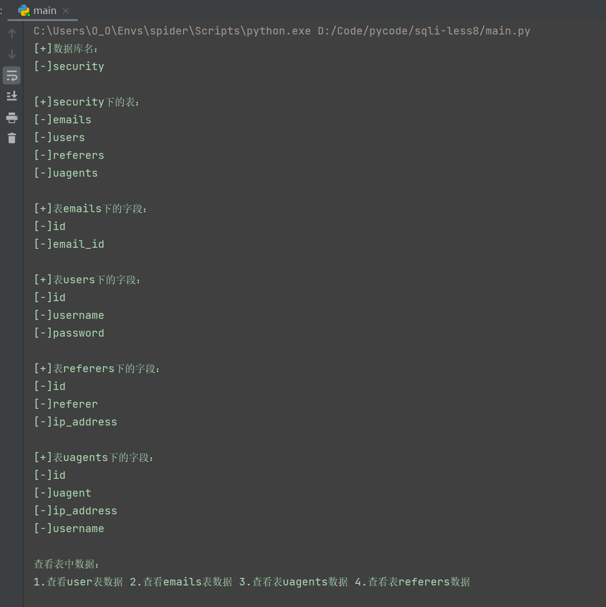
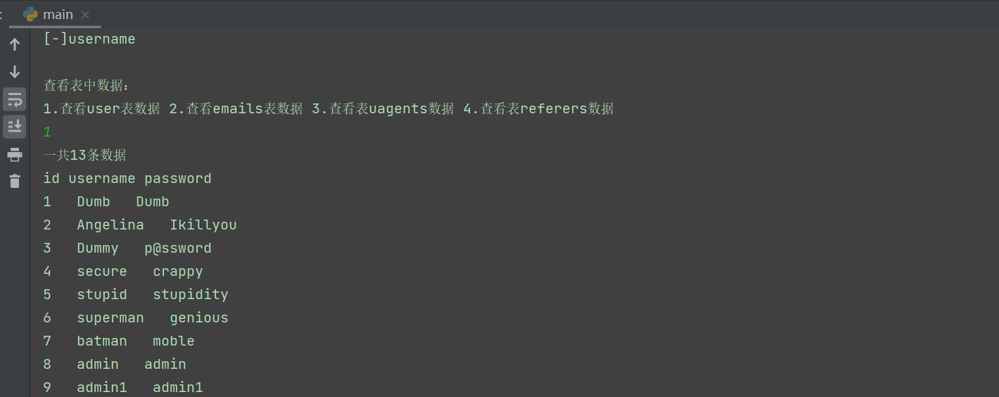
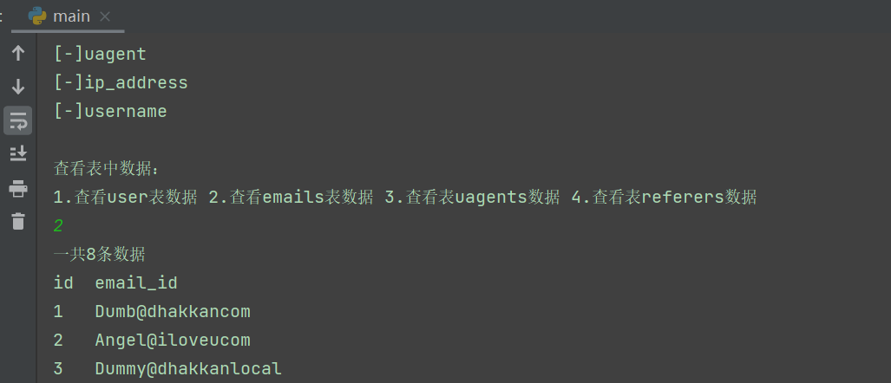
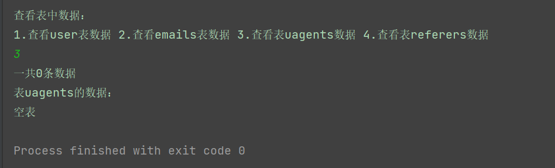
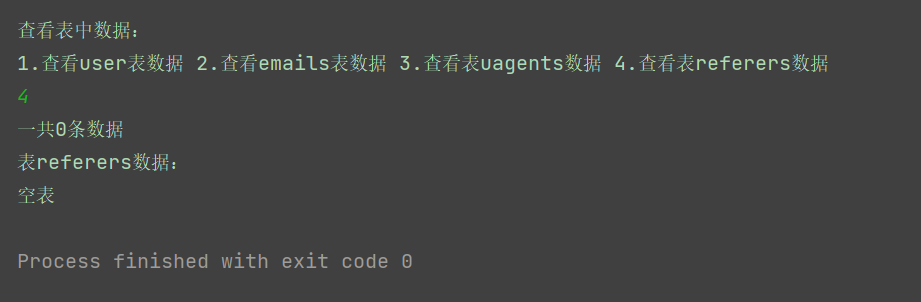
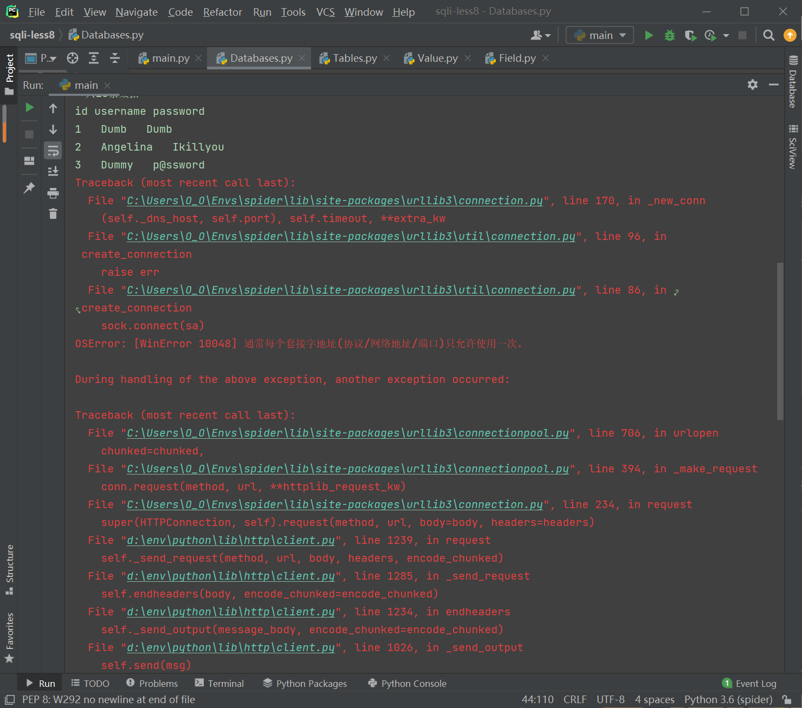

# 运行结果

## 数据库名、数据表及其字段

运行主函数：

## 各表的数据

### user表的数据

输入1查看user表的数据是否成功获取：

### emails表的数据

重新运行main函数，输入2查看emails表的数据

### uagents表的数据

重新运行main函数，输入3查看uagents表的数据

### referers表的数据

重新运行main函数，输入3查看referers表的数据

## 存在的问题

1. 代码冗余度过高，多个函数存在相似的代码

2. 灵活性差，只能对sqli-labs的less8这一个网页渗透

3. 获取数据功能存在未解决的bug

   获取数据表中的数据时会随机抛出异常无法获取完整的数据

   
